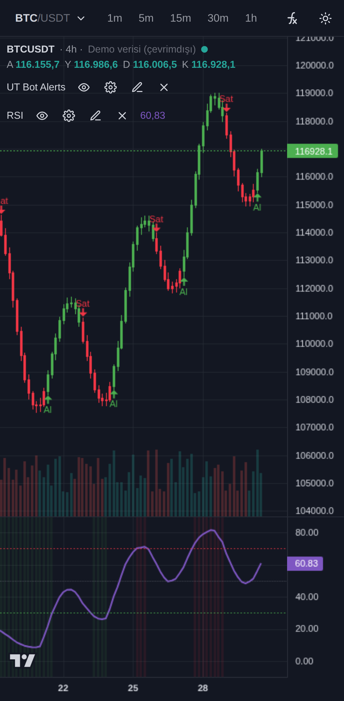
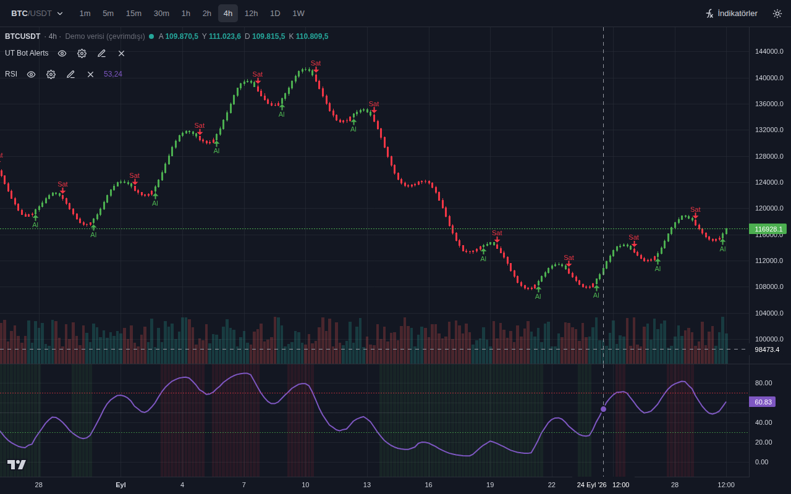

# Grafik — TradingView benzeri grafik + Pine Script indikatörleri ve strateji testi

Tarayıcıda çalışan, kurulum gerektirmeyen bir grafik ekranı. Binance mumlarını gösterir ve **Pine Script** ile
yazılmış indikatörleri çalıştırır: TradingView'daki bir göstergenin kaynak kodunu kopyalayıp buraya yapıştırman
yeterli (ör. **UT Bot Alerts**). `strategy()` betikleri **Strateji Test Aracı**'nda geriye dönük test edilir
(net kâr, işlem listesi, düşüş…). Çizim araçları yoktur; odak grafik ve kodla indikatördür.

| Telefon | Masaüstü |
|---|---|
|  |  |

## Kullanım

- **Sembol:** sol üstteki `BTC/USDT` düğmesi → ara ya da favorilerden seç (yıldızla favori ekle).
- **Zaman dilimi:** üst çubuk (1m … 1W).
- **İndikatör ekle:** `ƒx İndikatörler` → **Kütüphane** (tek dokunuş) ya da **Kod yaz** (Pine kodunu yapıştır →
  *Kaydet ve grafiğe ekle*). Hatalı kodda satır numarası gösterilir.
- **İndikatör satırı** (grafiğin sol üstü): göz = gizle/göster, dişli = ayarlar (koddaki `input` tanımlarından
  otomatik form), kalem = kodu düzenle, çarpı = kaldır.
- Kodların ve eklediğin indikatörler **bu tarayıcıda** saklanır. Başka cihaza taşımak için *Kodlarım → dışa aktar*
  (`.pine` dosyası) ve diğer cihazda *Dosyadan*.
- Telefonda tarayıcı menüsünden **Ana ekrana ekle** dersen uygulama gibi açılır.
- Grafiği sola kaydırdıkça eski mumlar yüklenir (en çok 5000 mum). Son mum canlı güncellenir.

## Strateji testi (backtest)

- Kütüphaneden **UT Bot Strateji**, **EMA Trend 4s Strateji (bot sistemi)**, **Rejim Strateji (günlük)** ya da
  **Trend Avcısı Strateji (15 dk)** ekle, veya TradingView'daki bir stratejinin kodunu yapıştır. Grafiğin altında özet şeridi çıkar (net kâr %, işlem sayısı, kârlı oran, düşüş).
- Şeride dokun → **Strateji Test Aracı**: *Özet* (net kâr, kâr faktörü, maks. düşüş, al-ve-tut karşılaştırması,
  özsermaye eğrisi, Tümü/Long/Short tablosu) ve *İşlemler* (her işlem; dokununca grafikte o işleme gider).
  Emirler grafikte ok olarak görünür.
- **Test dönemi:** test aracının üstünde başlangıç/bitiş tarihi ya da hızlı seçim (30 gün, 90 gün, 6 ay, 1–3 yıl,
  bu yıl, tümü); aynı tarihler *Ayarlar → Strateji özellikleri*'nde de var. Emirler yalnız bu aralıkta verilir,
  aralık bitince açık pozisyon son mumun kapanışında kapatılır ("Dönem sonu"); net kâr, işlemler, düşüş, özsermaye
  eğrisi ve al-ve-tut yalnız bu aralıktan hesaplanır. Göstergeler aralıktan önceki verilerle ısınır.
- **Ayarlar → Strateji özellikleri:** başlangıç sermayesi, emir büyüklüğü (özsermaye %, adet, USDT), piramit,
  komisyon (Binance vadeli piyasa emri ≈ %0,05), kayma, emirleri kapanışta doldurma.
- Strateji varken geçmiş en az 5000 muma, test başlangıcı daha eskiyse oraya kadar tamamlanır (en çok 50.000 mum;
  ör. 1 saatlikte ≈ 5,7 yıl). Uzun geçmişte canlı mumla yeniden hesap seyrekleşir.
- Emir doldurma TradingView'ın varsayılanıyla aynıdır: sinyal mumu kapandıktan sonra bir sonraki mumun açılışında;
  stop/limit emirleri mum içinde (açılış → yüksek/düşük → kapanış varsayımı, boşlukta açılıştan). Teminat,
  likidasyon ve fonlama ücreti hesaba katılmaz. `?demo` verisi yapay (düzgün dalgalar) olduğundan oradaki
  strateji sonuçları anlamsızdır; gerçek sonuç için Binance verisiyle kullan.

## Rejim (günlük) — rejime göre kural, ileriye doğru yürüyen testle seçildi

Kütüphanede gösterge (**Rejim**: arka plan rengi yükseliş yeşil / düşüş kırmızı / yatay gri; Al/Sat/Çık etiketleri,
kâr al / zarar kes çizgileri, alarmlar) ve backtest sürümü (**Rejim Strateji**) olarak var; ikisi aynı işlemleri verir
(testte denetlenir). Grafik **1 gün** olmalı.

- **Rejim** (mum kapanışında, `ta.dmi(14, 14)` ve EMA50): yükseliş = kapanış > EMA50, +DI > −DI, ADX > 20; düşüş =
  kapanış < EMA50, −DI > +DI, ADX > 20; yatay = diğerleri.
- **Kurallar** (girişler sonraki mumun açılışında; kâr al / zarar kes sinyal mumundaki ATR14'ün katı; en çok 20 gün;
  pozisyon varken yeni giriş yok):

| Rejim | Kural | Kâr al / zarar kes |
|---|---|---|
| Yükseliş | UT Bot (anahtar 2) "Sat" verince **al** (geri çekilmede alım) | 0,5 / 2 × ATR |
| Düşüş | RSI14 < 30 ise **al**, > 70 ise sat (aşırılıktan dönüş) | 1 / 2,5 × ATR |
| Yatay | UT Bot (anahtar 3) "Al" verince **al** | 1,5 / 3 × ATR |

- **Nasıl bulundu:** "%70 kazanma her yerde çıkıyorsa, şu an hangi trendde olduğunu bulup ona göre strateji" fikri,
  2020-2026 verisinde (15 coin) **ileriye doğru yürüyen testle** sınandı (`tools/backtest/regime_study.py`). Her yılın
  başında, yalnız o güne kadar kapanmış işlemlere bakılarak, her rejim için 2268 kuraldan (1 s / 4 s / 1 g × 18 olay
  × devam/ters × 7 kâr al/zarar kes × yön) en sağlamı seçildi ve o yıl uygulandı. Ölçütler çalıştırmadan önce
  `protocol.ts`'e (R_STUDY) yazıldı. Yukarıdaki kurallar aynı yöntemin bugünkü (2026-09 sonuna kadarki veriyle) seçimidir.
- **Sonuç — örneklem dışı** (her yıl yalnız geçmişe bakarak; komisyon %0,05/taraf sonrası):

| Yıl | İşlem | Kazanma | İşlem başına | Kâr faktörü |
|---|---|---|---|---|
| 2021 | 375 | %67,5 | +%0,51 | 1,09 |
| 2022 | 294 | %72,8 | +%0,27 | 1,06 |
| 2023 | 105 | %79,0 | +%1,68 | 1,69 |
| 2024 | 107 | %77,6 | +%1,81 | 1,62 |
| 2025 | 97 | %77,3 | +%3,20 | 2,40 |
| 2026 (Oca-Eyl) | 101 | %53,5 | **−%3,50** | 0,45 |
| **2021-2026** | **1079** | **%70,6** | **+%0,55** | **1,12** |

  Önceden yazılan ölçütleri geçti (kazanma ≥ %70, ort. > 0, PF > 1, 6 yılın 5'i artı, 15 coinin 11'inde PF > 1), ama
  **istatistiksel gücü zayıf** (t = 1,5) ve 2026 zararlı. Fonlama ücreti küçük (işlem başına ~%0,02). Aynı yöntem
  rastgele girişli kurallara uygulanınca kâr çıkmadı (−%0,19); yani sonuç yöntemin kendisinden gelmiyor. BTC'nin
  rejimine göre seçim (+%1,69, 770 işlem) ve rejimsiz seçim (+%1,74, 429 işlem) de artıda, onlar da 2026'da zararlı.
- **Rejimlere göre** (2023-2026, bugünkü türden kurallar): yükseliş 97 işlem, %86,6 kazanma, +%1,50, dört yılın dördü
  artı; düşüş 189 işlem, %70,4, +%1,06 ama 2026'da −%5,2 (zararın kaynağı); yatay 124 işlem, %62,9, −%0,16 (zayıf).
  Ayarlardan her rejim ayrı ayrı kapatılabilir.
- **Bugün (2026-09-29):** 15 coinin 13'ü yükseliş rejiminde (TRX yatay), yani etkin kural yükseliş kuralı.
- **Altında** (ayarlar değiştirilmeden; altın seçimde hiç kullanılmadı): spot PAXGUSDT (altına bağlı token)
  2021-01 → 2026-09, 51 işlem, %76,5 kazanma, işlem başına +%0,03 (fiilen başa baş). 2021-2025'in her yılı artı,
  2026'da 10 işlem, %40 kazanma, −%2,8. Yılda ~9 sinyal. Yalnız altın verisiyle yapılan kural seçimi tutmadı
  (rastgele kurallardan farksız; `regime_study.py --coins SPOT-PAXGUSDT --tag altin`).
- **Uygulamada örnek** (Strateji Test Aracı, 2025-01-01 → 2026-09-29, gerçek veri): SOL 16 işlem, %68,8 kazanma,
  net +%27,6 (al-ve-tut −%37,1), maks. düşüş %36; BTC 19 işlem, %63,2 kazanma, net −%8,2 (al-ve-tut −%10,6).
  Coin ve dönem kısaldıkça sonuç çok değişir.
- **Risk:** günlük grafikte zarar kes 2-3 × ATR, tek işlemde %10-30 kayıp demek; özsermayenin %100'ü ile düşüş
  büyüktür (örneklem dışında coin başına en büyük düşüş medyanı %68), daha küçük emir büyüklüğü kullan. Bugünkü
  kurallar 2021-2026'nın tamamıyla seçildiği için o dönemdeki sonucu (motorla 695 işlem, %78, +%2,77) iyimserdir;
  beklenti için yukarıdaki örneklem dışı tablo esas alınmalı. Geçmiş sonuç gelecek garantisi değildir.

## Trend Avcısı (15 dk) — araştırma stratejisi (uzun geçmişte tutmadı)

> **Uyarı:** 2024-09 → 2026-09 sınavlarını geçti, ama hiç görmediği **2020-01 → 2024-08**'de (15 coin, 6304 işlem)
> zarar etti: işlem başına −%0,12, PF 0,95; 2020-2024'ün her yılı sıfır ya da eksi. Gerçek parayla kullanmak için
> yeterli kanıt yok.

Kütüphanede gösterge (**Trend Avcısı**: Al/Sat/Çık etiketleri, iz süren stop çizgisi, alarmlar) ve backtest sürümü
(**Trend Avcısı Strateji**) olarak var; ikisi aynı işlemleri verir (testte denetlenir). Grafik **15 dk** olmalı.

- **Kural:** fiyat günlük EMA50'nin üstündeyken kapanış son 192 mumun (2 gün) en yükseğini aşarsa long, altındayken en
  düşüğünün altına inerse short; sonraki mumun açılışında giriş. Zarar kes giriş ∓ 3 × 1 saatlik ATR; kâr al yok,
  iz süren stop işlemde görülen en iyi fiyatın 5 × ATR gerisinde (mum kapanışında güncellenir); en çok 10 gün.
- **Kazanma oranı düşüktür (~%33-37):** çok sayıda küçük zarar, az sayıda büyük trend kazancı.
- **Sonuçlar** (Binance vadeli, komisyon %0,05/taraf, işlem başına getiri komisyon sonrası; sermayenin %100'ü):

| Veri | İşlem | Kazanma | İşlem başına | Kâr faktörü |
|---|---|---|---|---|
| Geliştirme: 2025-04 → 2026-06, 8 coin | 920 | %36,7 | +%0,29 | 1,18 |
| **Son sınav** (hiç bakılmamış): 2026-07 → 2026-09, BTC/ETH/SOL/XRP/BNB/DOGE | 160 | %33,1 | +%0,04 | 1,03 |
| **Görülmemiş coinler** (hiç kullanılmamış): XRP/BNB/DOGE, 2024-09 → 2026-09 | 559 | %36,7 | +%0,60 | 1,37 |
| **Uzun geçmiş** (hiç görülmemiş): 2020-01 → 2024-08, 15 coin | 6304 | %34,4 | −%0,12 | 0,95 |
| Karşılaştırma: orijinal UT Bot Strateji, son sınav dönemi, 15 dk | 6302 | %28,4 | −%0,11 | 0,65 |

  Görülmemiş coinlerde gerçek fonlama ücretleriyle +%0,59/işlem; son sınav dönemi fiilen başa baş (%0,065 komisyonda
  PF 1,00). Uygulamada örnek: DOGE 2025-05-01 → 2026-09-29 net +%60,4 (al-ve-tut −%45,8), **maks. düşüş %39**;
  BTC son sınav dönemi −%3,4 (al-ve-tut +%42,4). Yatay dönemlerde küçük zararlarla beklenir; özsermayenin %100'ü ile
  düşüş büyüktür, daha küçük emir büyüklüğü kullan. Geçmiş sonuç gelecek garantisi değildir.
- **Neden %70 kazanma + kâr yok (bütün denemeler):** her denemede kural önce geliştirme verisinde bulundu, sonuçlardan
  önce donduruldu, sonra hiç görülmemiş veride bir kez sınandı:

| Deneme | Grafik | Hiç görülmemiş veri | İşlem | Kazanma | İşlem başına |
|---|---|---|---|---|---|
| UT Bot Pro (UT trendi + güçlü mum) | 15 dk | 2026-04 → 06, BTC/ETH/SOL | — | %63,3 | −%0,25 |
| Momentum 4s (sert mum / RSI aşırılığı) | 4 saat | ADA/AVAX/LINK/LTC, 2024-11 → 2026-09 | 377 | %74,5 | −%0,04 |
| Momentum 4s | 4 saat | 8 coin, 2024-11 → 2025-03 | 180 | %68,3 | −%0,95 |
| Günlük Momentum (sert mum) | 1 gün | 15 coin, 2023-01 → 2024-08 | 308 | %71,8 | −%0,07 |
| Günlük Momentum | 1 gün | 15 coin, 2024-09 → 2026-09 | 401 | %77,8 | +%0,97 |
| Trend Avcısı | 15 dk | 15 coin, 2020-01 → 2024-08 | 6304 | %34,4 | −%0,12 |
| **Rejim** (ileriye yürüyen seçim) | 1 gün | 15 coin, 2021-01 → 2026-09, her yıl yalnız geçmişe bakarak | 1079 | %70,6 | +%0,55 |

  %70+ kazanma her grafikte ve görülmemiş veride de çıkıyor, çünkü kâr al küçük, zarar kes büyük seçiliyor (rastgele
  girişte bile ~%75). Ama kâr sağlam değil: aynı kural bir dönemde artı, başka dönemde eksi. Günlük grafikte her
  işlemde sermayenin tamamıyla coin başına en büyük düşüş medyanı %35-42. 5 dk'da UT Bot sinyallerinin, 15 dk'da 12
  ek özelliğin (hacim, alıcı baskısı, fonlama, saat, oynaklık…) rastgele girişe göre tutarlı üstünlüğü yok; 1 saatte
  aday çıkmadı. Sonuç: tek bir sabit kural 2020-2026 boyunca tutarlı kâr etmedi. Rejime göre kural seçen yöntem
  (yukarıda **Rejim**) ileriye yürüyen testte ölçütleri geçti, ama zayıf ve 2026'da zararlı.
- **Yöntem ve yeniden üretim:** `tools/backtest/` (aşağıda). Veri ayrımı ve kabul ölçütleri sonuçlardan önce
  `tools/backtest/protocol.ts`'te sabitlendi, her değişiklik orada kayıtlı; son sınav bir kez açıldı.

## Veri

Binance USDT-M vadeli piyasasının herkese açık uçları (anahtar gerekmez). Vadeli uçlara ulaşılamazsa otomatik olarak
spot verisine geçer. `?demo` ile çevrimdışı demo verisi açılır (bağlantısız deneme).

## Pine Script desteği

v4, v5 ve v6 betiklerinin göstergelerde kullanılan kısmı:

- **Dil:** değişkenler, `var`/`varip`, `:=` ve `+=`…, geçmiş (`close[1]`, `x[2]`), `if`/`else if` (deyim ve
  ifade), `switch`, `for … to … by`, `for … in`, `while`, `break`/`continue`, kullanıcı fonksiyonları (tek satır
  ve blok, varsayılan parametre), demetler `[a, b] = f()`, diziler (`array.*` ve `arr.push()` yazımı), satır devamı.
- **ta.\*:** sma, ema, rma, wma, vwma, hma, swma, alma, atr, tr, rsi, macd, stoch, cci, mfi, bb, bbw, kc, kcw,
  dmi, supertrend, sar, wpr, tsi, cmo, highest, lowest, highestbars, lowestbars, crossover, crossunder, cross,
  change, mom, roc, stdev, variance, dev, median, percentrank, linreg, correlation, cum, vwap, valuewhen,
  barssince, pivothigh, pivotlow, rising, falling, range; `ta.obv`, `ta.accdist`.
- **Diğer:** `math.*`, `str.*`, `color.*`, `nz`, `na`, `fixnan`, zaman fonksiyonları (`time`, `year`, `hour`…),
  `timeframe.*`, `syminfo.*`, `barstate.*`, tüm `input.*` türleri.
- **Çizim:** `plot` (line, linebr, stepline, histogram, columns, area, circles, cross; mum başına renk, offset),
  `plotshape`, `plotchar`, `plotarrow`, `barcolor`, `bgcolor`, `hline`, `alertcondition`/`alert` (kaydedilir),
  `indicator(overlay=…)` ile fiyat paneli ya da alt panel.
- **request.security:** başka zaman dilimi veya başka sembol (`"BINANCE:ETHUSDT.P"`, `"ETHUSDT"`), `lookahead` ve
  `gaps` TradingView'daki anlamıyla, Heikin Ashi (`ticker.heikinashi`); gereken veri otomatik indirilir.
- **v4 uyumu:** `study`, `security`, `iff`, önek olmadan `sma`/`atr`/`crossover`…, `input(type=…)`, `transp`.

- **strategy:** `strategy()` ayarları (sermaye, `default_qty_type/value`, `pyramiding`, komisyon, kayma,
  `process_orders_on_close`…), `strategy.entry/order/close/close_all/exit/cancel/cancel_all` (limit, stop,
  kâr al/zarar kes, iz süren stop, kısmi çıkış, OCA), `strategy.risk.allow_entry_in`, `strategy.position_size`,
  `position_avg_price`, `equity`, `netprofit`, `openprofit`… (geçmişleriyle: `strategy.position_size[1]`),
  `strategy.closedtrades.*` / `strategy.opentrades.*`; v4 yazımı (`when=`, `strategy.entry("L", true)`).

**Henüz yok:** `label`/`line`/`box`/`table` çizim nesneleri (hata vermez, yok sayılır ve uyarı gösterilir),
`fill` (iki çizgi arası dolgu), `type`/`method`/`import`, `matrix`/`map`, strateji tarafında teminat/likidasyon,
`calc_on_order_fills` ve `strategy.risk.*` sınırları (allow_entry_in hariç).

Doğruluk: yerleşik göstergeler bağımsız bir Python referansıyla birebir aynı çıktıyı verir
(`tools/make_fixtures.py`, `tests/pine.ref.test.ts`); UT Bot Alerts'in v4 ve v5 yazımları dahil. Strateji motoru
elle hesaplanmış senaryolarla (`tests/pine.strategy.test.ts`) ve kütüphane stratejileri bağımsız bir işlem
simülasyonuyla (`tests/pine.strategy.lib.test.ts`) birebir karşılaştırılır.

## Geliştirme

```bash
npm ci
npm run dev          # http://localhost:5173  (demo: /?demo)
npm test             # yorumlayıcı + veri testleri (vitest)
npm run e2e          # tarayıcı testleri (Playwright)
npm run build        # dist/ (statik site)
```

Strateji araştırması (`tools/backtest/`; uygulamanın kendi Pine motoru Node'da, sonuçlar Strateji Test Aracı'yla aynı):

```bash
# veri: bot deposunun market-data dalı (data.binance.vision'dan GitHub Actions ile indirilen 1 dk mumlar)
git -C ../bot fetch --depth 1 origin market-data && mkdir -p .cache/market-data
git -C ../bot archive origin/market-data | tar -x -C .cache/market-data
npm run bt:import                                   # → .cache/bars (1m/5m ikili; pandas + pyarrow gerekir)
python3 tools/backtest/analyze.py --tf 15m          # piyasa davranışı analizi (olay sonrası, önce hangisi, saatler)
python3 tools/backtest/strategy_lab.py              # 15 dk strateji laboratuvarı (8 aile, temkinli dolum)
npm run bt:sweep -- tools/backtest/specs/t1_dev2.ts # motorla tarama/doğrulama (4 işçi)
npm run bt:final                                    # son sınav (frozen.json; her çalıştırma bakış kaydına yazılır)
# uzun geçmiş: research-data dalı (15 dk mumlar, 2020 → )
git -C ../bot fetch --depth 1 origin research-data:refs/remotes/origin/research-data && mkdir -p .cache/research-data
git -C ../bot archive origin/research-data | tar -x -C .cache/research-data
python3 tools/backtest/import_research_data.py      # → .cache/bars/<SYM>_15m.f64 (+ funding birleşimi)
python3 tools/backtest/htf_study.py --tf 4h         # 1 s / 4 s olay çalışması (htf_momentum.py: 4 s sağlamlık)
python3 tools/backtest/long_study.py                # 2020-2022 taraması: 15 dk / 1 s / 4 s / 1 g
npm run bt:final -- --frozen tools/backtest/frozen_4h.json --study-h   # 4 s sınavı
npm run bt:final -- --frozen tools/backtest/frozen_1d.json --study-l   # uzun geçmiş sınavları
npm run bt:final -- --study-t                       # Trend Avcısı, 2020-01 → 2024-08
python3 tools/backtest/regime_study.py              # rejim çalışması: ileriye doğru yürüyen test (2021-2026)
# altın: .github/workflows/altin-verisi.yml (GitHub'da indirir, dala data/altin/ yazar) → içe aktar → sınavlar
python3 tools/backtest/import_gold_data.py          # data/altin → .cache/bars (SPOT-PAXGUSDT, XAUUSDT, …)
npm run bt:final -- --study-g --coins SPOT-PAXGUSDT,XAUUSDT,PAXGUSDT   # Rejim Strateji altında
python3 tools/backtest/regime_study.py --coins SPOT-PAXGUSDT --tag altin --min-trades 40
npm run bt:sweep -- tools/backtest/specs/r1_rejim.ts  # Rejim Strateji, motorla 2021-2026 (laboratuvarla eşleşme)
BT_REAL=1 npx playwright test e2e/real.spec.ts      # uygulamada gerçek veriyle aynı sonuç + ekran görüntüsü
```

Yapı: `src/pine/` (lexer → parser → derleyici → yürütme, `strategy.ts` emir/işlem motoru, `builtins/`, `library/`),
`src/data/` (Binance, demo),
`src/indicators/` (hesap akışı), `src/worker/` (yorumlayıcı ayrı iş parçacığında), `src/chart/` (lightweight-charts),
`src/ui/`.

Yayın: `render.yaml` (Render statik site). Grafik kütüphanesi: TradingView
[lightweight-charts](https://github.com/tradingview/lightweight-charts) (Apache-2.0; grafikteki TradingView
logosu lisans gereğidir).
